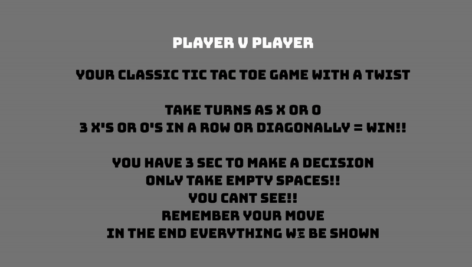

# # Blind Tac Toe
A twist on classic Tic Tac Toe — players can’t see their moves until the game ends.  
Clicking an occupied cell results in an instant loss!

## How to Play
[Play here](https://l1sap.github.io/BlindTacToe/menu.html)  
- Take turns as X and O
- you have 3 seconds
- Don’t click a cell twice!

## Preview

