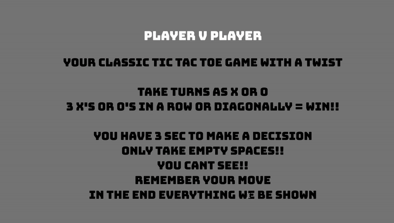

# Blind Tac Toe
A twist on classic Tic Tac Toe where players can’t see their moves until the game ends.  
Clicking an occupied cell results in an instant loss!

## How to Play
- Take turns as X and O
- Each player has 3 seconds
- Don’t click a cell twice!
- Moves are hidden until the game ends

## Play the game
[Play here](https://l1sap.github.io/BlindTacToe/menu.html) 

## Preview

